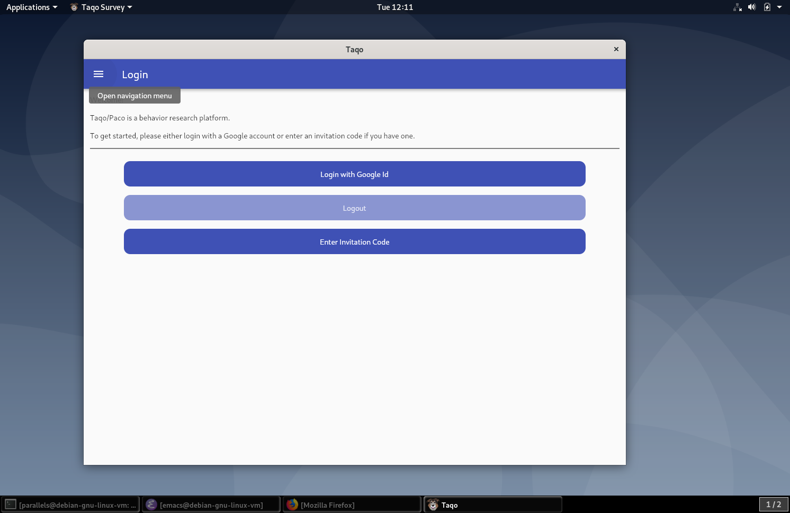
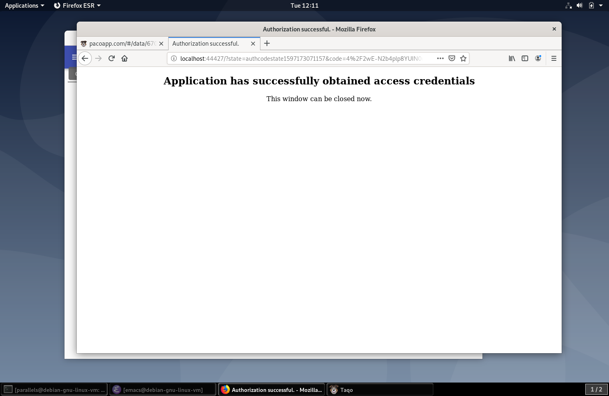
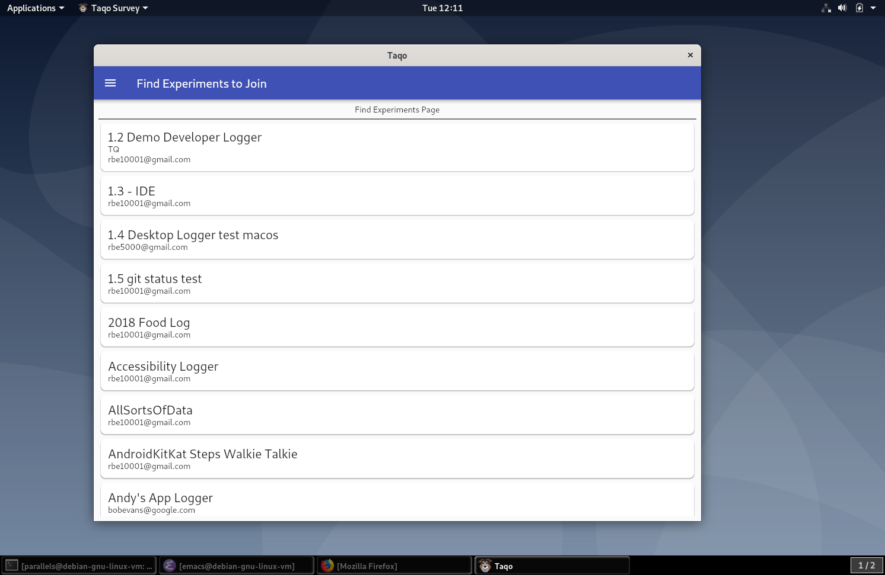
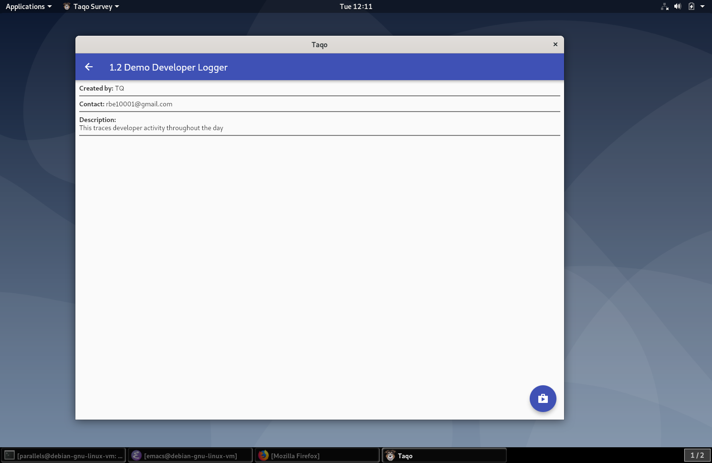
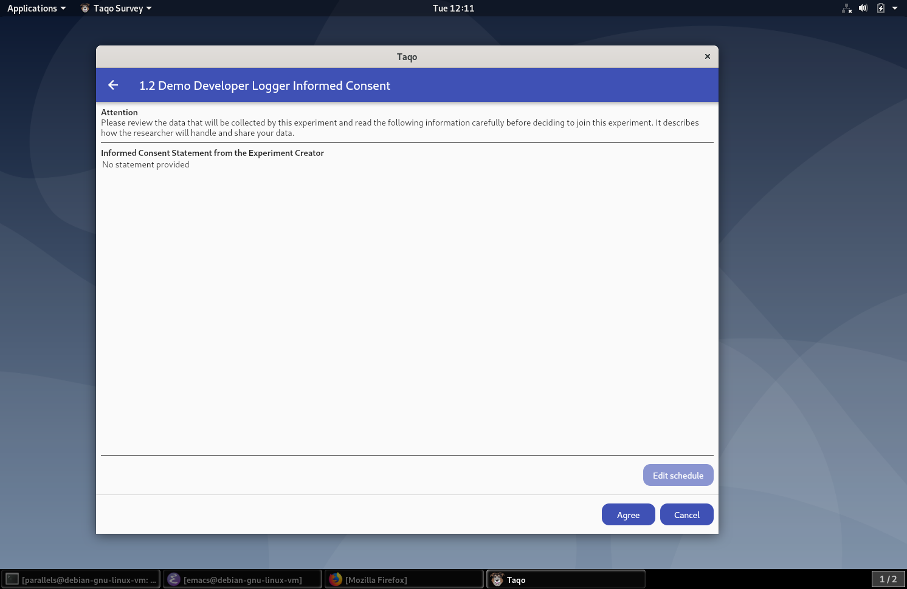
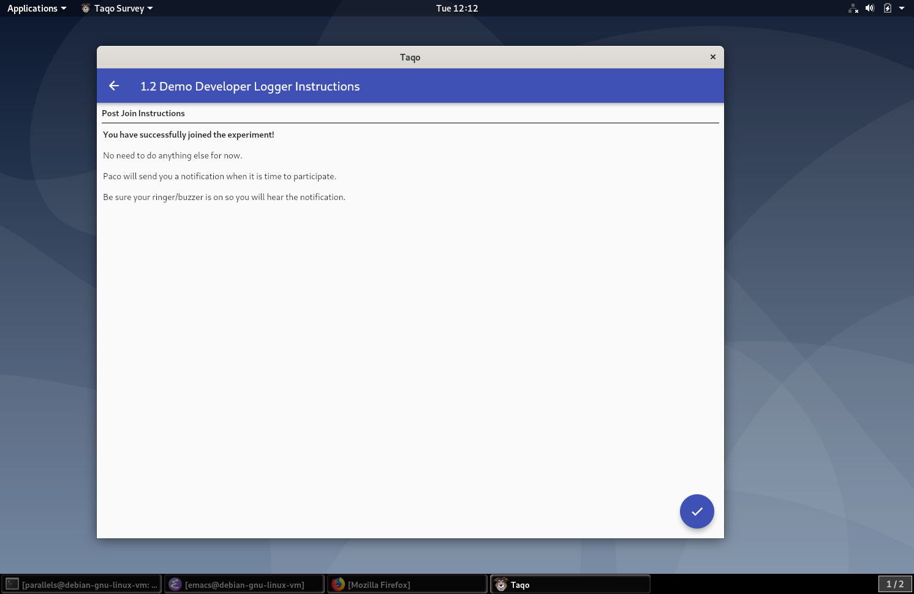
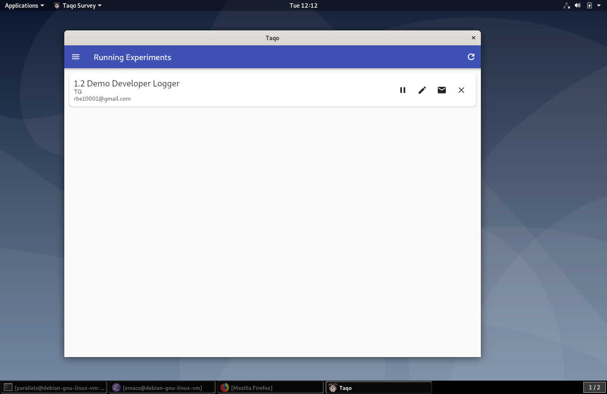
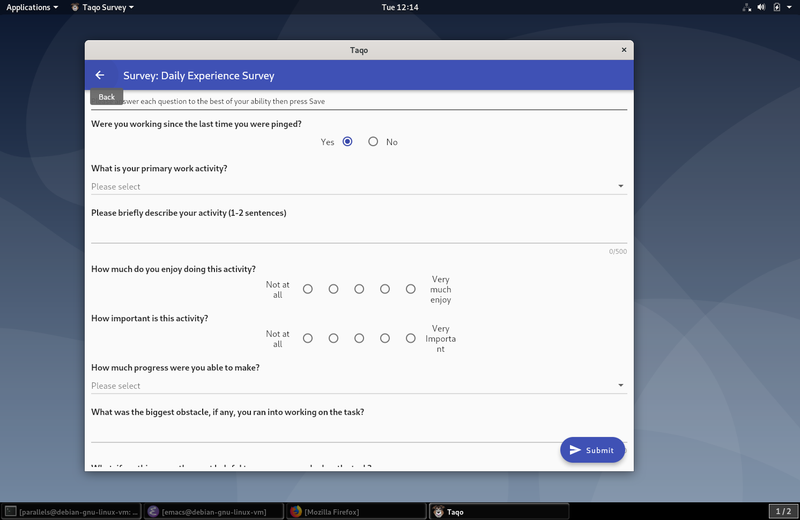
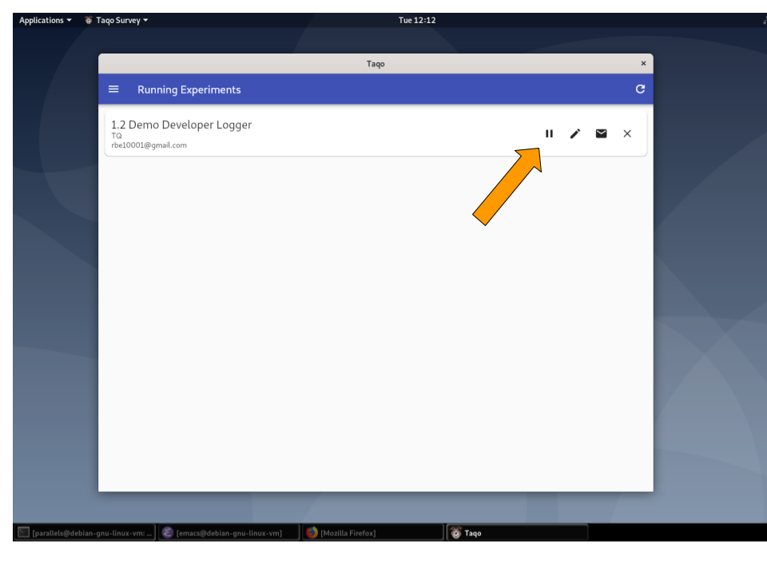
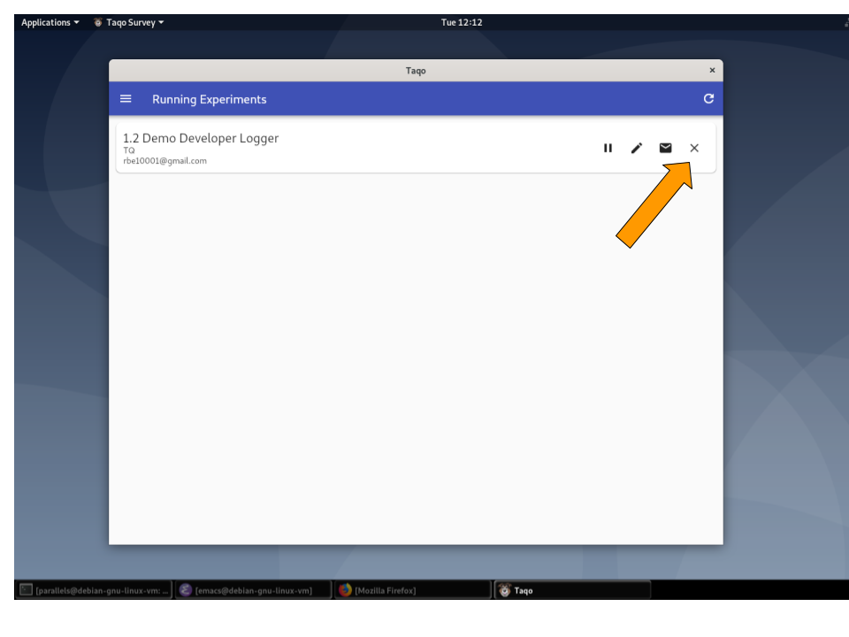

# Paco:Taqo Linux Installation Instructions

**Table of Contents**
[System Requirements](#system-requirements)
[Installing the Taqo research app and joining the study](#installing-the-taqo-research-app-and-joining-the-study)
[Responding to a Survey Notification](#responding-to-a-survey-notification)
[Pausing the study](#pausing-the-study)
[Leaving the study](#leaving-the-study)


### System Requirements

**OS:** Linux (64bit)

**OS Version:** Any Google/glinux distribution should work. gLinux laptops should work as well but we have not tested these.

**Window Environment:** X11-based (not Wayland-based). 

**Shell**: bash or zsh

**(Optional) Ideal IDE (developer environment)**: Any Jetbrains IDE, e.g., Android Studio, IntelliJ, CLion, ...


### Installing the Taqo research app and joining the study 

Taqo is the application that manages the study data collection. It will notify you to participate in surveys. 


1. To join the study, please download the latest Taqo linux package: 

    [Taqo Download Release Page](https://github.com/google/taqo-paco/releases)

2. In a terminal, run the command

    ```
    %> sudo dpkg -i taqosurvey_<version>_amd64.deb
    ```


    If the command complains about missing dependencies, run


    ```
    %> sudo apt install -f

    ```
    This will install the Taqo debian package and the required dependencies. You may need to adjust this command to include the directory that it was downloaded to.


3. Launch the Taqo client app

    ```
    %> taqo

    ```
    The Taqo app will present a login screen.
    
    


4. Please tap on ‘Login with Google’. This will open your browser and take you to Google’s auth site to do the authentication. 
     


5. Once you authenticate, the browser will tell you that you can close the window. 

    


6. You can return to the Taqo app and it will search for your research study.
    
    


7. Select the study by clicking on its title. Press the button in the lower right corner to enroll. 
    
    


8. You will be shown the Informed Consent and Data Handling agreement, only proceed if you understand and accept these terms.

     


9. Then, if the experiment has a user-editable schedule for notifications,  you will be shown the Schedule for sampling. You can modify this schedule to suit your hours for study participation. Click the save button in the lower right once you are done and use the back arrow to navigate out.

    
    You are now enrolled in the study and can close the Taqo app. It will notify you if it is time to participate in a survey.


    


10. NOTE: If you are participating in a developer logging study, please do the following two steps to enable the loggers. Otherwise, the study will not collect developer activity and may not be able to detect events that would trigger surveys.

11. Restart any IntelliJ-based IDEs to enable the dev logging plugin


12. Restart your terminal or source your .bashrc or .zshrc file to enable terminal command logging
     `%> source ~/.bashrc`


### Responding to a Survey Notification 

If the study needs you to fill out a survey, it will pop up a desktop notification. Click that notification to be taken to the survey. Or, you can open Taqo and click on the Study name to fill out the survey.




Click Submit in the lower right hand corner when you are done.




### Pausing the study

To pause data collection, open Taqo and click the “⏸” icon to the right of the study name. This will pause the survey’s data collection until you click again to resume.




### Leaving the study

At any time, you can open the Taqo app and stop the study by clicking the ‘X’ icon to the right of the study name. 

Note: If you are in a logging study, please leave the study by this method to cleanly remove any IDE plugins and shell loggers (located in the .rc file) from your desktop environment.



After leaving a study explicitly, or, if a study has ended, you can uninstall Taqo. Please stop the taqo\_daemon first.

For a full uninstall, you can run the following commands:

```
    sudo apt remove taqosurvey
    sudo apt autoremove

    rm -rf ~/.local/share/taqo
